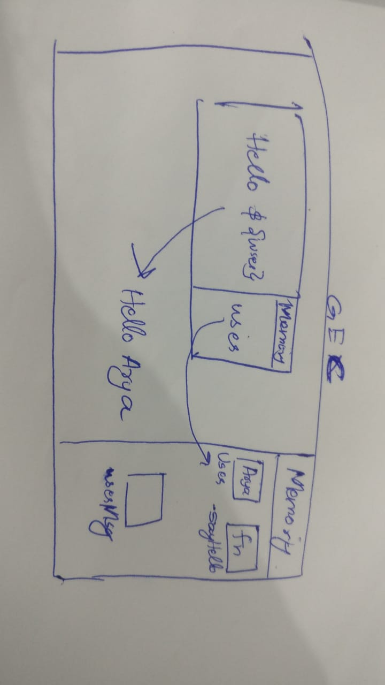
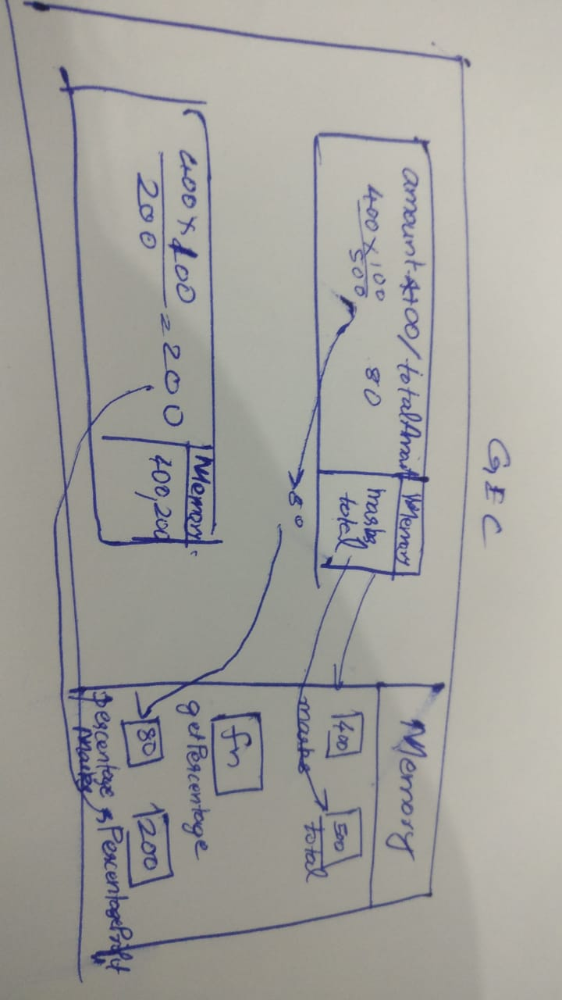

1. What does thread of execution means in JavaScript?
When the Javascript engine takes the code and then executes it line by line, then it's called thread of execution
2. Where the JavaScript code gets executed?
It gets executed in the Global Execution Context
3. What does context means in Global Execution Context?
It holds information about the environment within which the current code is being executed
4. When do you create a global execution context.
Whenever there is a snippet of code, the global execution context is created and its created only once for each snippet of code
5. Execution context consists of what all things?
It consists of everything within the code
6. What are the different types of execution context?
Global execution context and function execution context
7. When global and function execution context gets created?
Whenever a code snippet is executed then the global execution context gets created and whenever there is a function call the function execution context gets created each time
8. Function execution gets created during function execution or while declaring a function.
Function execution context gets created during function execution


9. Create a execution context diagram of the following code on your notebook. Take a screenshot/photo and store it in the folder named `img`. Use `` to display it here.


```js
var user = "Arya";

function sayHello(){
  return `Hello ${user}`;
}

var userMsg = sayHello(user);
```

<!-- Put your image here -->




```js
var marks = 400;
var total = 500;

function getPercentage(amount, totalAmount){
  return (amount * 100) / totalAmount;
}

var percentageMarks = getPercentage(marks, total);
var percentageProfit = getPercentage(400, 200);
```

<!-- Put your image here -->




```js
var age = 21;

function customeMessage(userAge){
  if(userAge > 18){
    return `You are an adult`;
  }else {
    return `You are a kid`;
  }
}

var whoAmI = customeMessage(age);
var whoAmIAgain = customeMessage(12);
```

<!-- Put your image here -->

